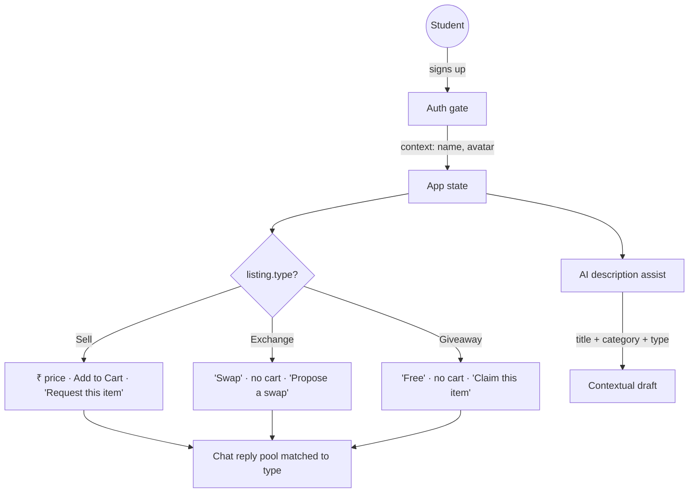

<div align="center">
  <h1>Pratidaan</h1>
  <p><b>A context-aware campus marketplace assistant</b></p>
  <p><a href="https://pratidaan.vercel.app/"><b>Live demo</b></a></p>
  <p>
    <a href="https://react.dev/"></a>
    <a href="https://vitejs.dev/"></a>
    <a href="https://tailwindcss.com/"></a>
    
    
  </p>
</div>

---

## 1. Chosen vertical

**Student / campus commerce.**

**Persona — the resident student.** They accumulate things each semester they no
longer need (last term's textbook, a mini fridge before moving out) and need
things they can't justify buying new. Their constraints shape every decision in
this app: they are broke, they are busy, they are on foot, and the person on the
other side of the trade is a stranger who shares their campus.

That persona is why this is deliberately *not* a generic e-commerce clone:

| Generic marketplace | Pratidaan |
| :--- | :--- |
| Everything has a price | Sell **/ Exchange / Giveaway** are first-class equals |
| "Add to Cart" on everything | Cart appears **only** on `Sell` items — you cannot "buy" a swap |
| Ships to an address | Every listing carries a **campus meetup spot** |
| Reviews after purchase | Meet-in-public safety note on every item |

---

## 2. Approach and logic

The core idea: **one listing object drives different app behaviour depending on
its type and the viewer's context.** Rather than branching the UI by hand in a
dozen places, the listing's `type` is the single input that a small set of
resolvers read from.



### Where the decision-making actually lives

Every one of these is a real branch on user context, not decoration:

| Decision | Input | Behaviour |
| :--- | :--- | :--- |
| Primary call-to-action | `item.type` | *Request this item* / *Propose a swap* / *Claim this item* |
| Price display | `item.type`, `item.price` | `₹3,000` / `Swap` / `Free` / `Ask` |
| Cart availability | `item.type` | Offered on `Sell` only — a giveaway has nothing to check out |
| Chat auto-reply | `item.type` | Separate reply pools; a swap listing negotiates a trade, a giveaway says "come grab it" |
| AI description | title + category + type | Category-specific hooks and type-specific closers |
| Toast wording | `item.type` | "Swap request sent to Marcus!" vs "Claim sent to Maya!" |
| Navbar identity | auth state | Shows the signed-in user's first name, not a stale "Log in" |
| Grid layout | result count | Bento grid re-flows; every 7th tile spans two columns |

### The AI assist

The **✨ Generate with AI** button on the post form composes a listing
description from what the user has already told us — title, category, and offer
type — because that is the point in the flow where a student stalls.

It defaults to a **local rule-based generator** (category-aware hooks × type-aware
closers, lightly randomised) so the feature works offline, instantly, and at zero
cost. If `VITE_OPENAI_API_KEY` is set it will call a real LLM instead, and on
*any* failure — missing key, network error, timeout, rate limit — it silently
falls back to the local generator. **The button can never hang or produce
nothing**, and the whole feature is optional: the form works identically if it is
never touched.

---

## 3. How the solution works

### Run it

```bash
npm install
npm run dev          # http://localhost:5173
```

### Test it

```bash
npm run build
npm run preview      # serves the build on :4173, required by the tests
npm test             # in a second terminal — 37 checks
```

### Architecture

Single-page React app with **no backend**. All state lives in `App.jsx` and flows
down; there is no global store because the state graph is small enough that
prop-passing stays readable and traceable.

```
src/
  App.jsx                     state, routing, all cross-cutting actions
  index.css                   design tokens + .glass / .glow / .lift utilities
  data/seed.js                25 seed listings
  utils/
    format.js                 ₹ formatting, relative dates, price labels
    generateDescription.js    AI assist + local fallback generator
    chatReplies.js            type-aware reply pools
  components/                 one file per screen or reusable unit
tests/
  helpers.mjs                 shared harness (launch, auth, checkers)
  e2e.test.mjs                31 end-to-end checks
  a11y.test.mjs               axe-core WCAG 2.1 AA audit, 6 screens
```

### Key flows

- **Auth gate** — nothing renders until signup; `Escape` cannot bypass it.
- **Browse** — live title search + category filter, animated hero orbit, bento grid.
- **Post an item** — validation, image upload *or* URL, AI description assist.
- **Item detail** — type-aware CTA, chat with the poster, cart/wishlist.
- **Cart → demo checkout** — card formatting, validation, simulated payment.
- **Profile** — My Listings (edit/remove) and Order & Request History.

---

## 4. Assumptions made

1. **No backend, by design.** State is in-memory and resets on refresh. This keeps
   the repo self-contained and reviewable; swapping in an API means replacing
   `useState(SEED_ITEMS)` and the handful of action handlers in `App.jsx`.
2. **Auth is simulated.** Any valid-format email and a 6+ character password are
   accepted. There is no credential store, so nothing is verified against one.
3. **Payment is simulated and labelled as such.** The checkout is marked
   *"Demo — no real payment"* on-screen, hints Stripe's well-known `4242…` test
   number, and never transmits or stores anything.
4. **The other side of a chat is simulated.** With no second user, a message sent
   into silence would look broken — so a short "typing…" pause and a type-aware
   canned reply stand in.
5. **"My Listings" means items posted this session,** since there is no persistent
   account to attribute older listings to.
6. **Seller ratings are deterministic decoration,** derived from a hash of the
   name. They are not real reviews and are not presented as such.
7. **Currency is INR** and meetup locations are campus-relative.

---

## 5. Engineering notes

### Testing — 37 automated checks, `npm test`

Tests drive **real Chrome against a real production build**, because every
significant bug this project actually hit was a browser-level one that a JSDOM
unit test would have missed:

- an image that **never loaded** because it was hidden with `display:none` while
  `loading="lazy"` waited for a layout box that never came;
- a toast that **silently swallowed clicks** meant for the form beneath it;
- a grid that **overflowed horizontally** only below the `lg` breakpoint.

### Accessibility — 0 violations, `npm run test:a11y`

axe-core (WCAG 2.1 A + AA) runs against six screens in CI. It caught two real
critical defects that visual review had missed — wishlist buttons with **no
accessible name**, and an unlabelled file input — both now fixed. Beyond the
audit: full keyboard support, `Escape` to dismiss overlays, `aria-pressed` on
toggles, visible focus rings, and `prefers-reduced-motion` honoured by every
animation.

### Security

- **No secret is ever committed.** `.env*.local` is git-ignored, and the one
  optional key is read from the environment. Because this is a backend-less SPA,
  any key would be bundled into client JS — so this is documented as
  local-experimentation-only, and the feature is fully functional without it.
- **No XSS surface** — no `dangerouslySetInnerHTML`, no `eval`, no raw
  `innerHTML`; React escapes all rendered user input.
- **Uploads validated client-side** for MIME type and a 5 MB ceiling.
- **`npm audit`: 0 vulnerabilities**, production and dev.

### Efficiency

- **~88 KB gzipped**, zero runtime dependencies beyond React.
- Derived state is memoised (`useMemo`) and handlers are stable (`useCallback`).
- Images lazy-load below the fold and degrade to a branded placeholder on failure.
- Animations are transform/opacity only, so they stay on the compositor.
