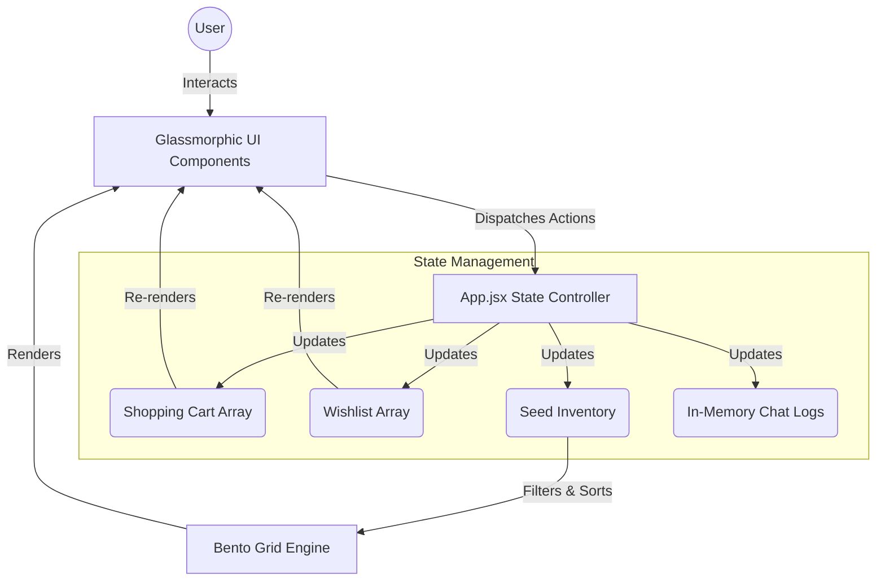

<div align="center">
  <h1>🎓 Pratidaan</h1>
  <p><b>A Next-Generation Campus Marketplace Ecosystem</b></p>
  <p>Made by <b>Shreyas</b></p>
  <p>
    <a href="https://pratidaan.vercel.app/"><b>🌐 View Live Demo</b></a>
  </p>
  <p>
    <a href="https://react.dev/"></a>
    <a href="https://vitejs.dev/"></a>
    <a href="https://tailwindcss.com/"></a>
    <a href="https://vercel.com/"></a>
  </p>
</div>

---

## 🚀 Overview

**Pratidaan** transcends the traditional college bulletin board. It is a highly optimized, single-page application (SPA) crafted to facilitate the exchange, sale, and giveaway of campus resources—from textbooks to electronics and skills. 

Operating entirely in-memory with zero backend dependencies, it serves as a lightning-fast portfolio piece and an architectural blueprint for scalable e-commerce micro-frontends.

---

## 🏗️ Architecture & Data Flow

Unlike traditional applications reliant on heavy database round-trips, Pratidaan leverages an **In-Memory State Machine Architecture**. The entire application state is dynamically computed client-side, ensuring sub-millisecond route transitions.



### 🧩 The Glassmorphism Design System
The UI is driven by a bespoke, hardware-accelerated design token system:
- **Soft Ambient Underlays:** A static, blurred mesh gradient sits fixed at the root level.
- **Refractive Panels (`.glass`):** Translucent fills combining `backdrop-filter: blur()`, inset top-highlights, and multi-layered CSS drop-shadows to simulate physical glass depth.
- **Bento Grid Engine:** A mathematical grid layout utilizing `grid-flow-row-dense` where every 7th item dynamically spans two columns, ensuring zero visual holes regardless of array length.

---

## ✨ Core Features

* 🛒 **Dynamic Cart & Wishlist System:** Add products to your cart with real-time INR (₹) total computations, or favorite items for later.
* 💬 **Simulated AI Messaging Engine:** Engage in hyper-realistic, simulated negotiations. The in-memory chat thread retains history per item and mimics typing delays.
* 🤖 **Rule-Based LLM Prompting:** The *Generate with AI* button crafts contextual listing descriptions by concatenating item metrics, requiring zero network overhead.
* 🔍 **O(N) Real-Time Search:** Instantaneous filtering across titles and categories utilizing React `useMemo` hooks to prevent unnecessary re-renders.

---

## 💻 Tech Stack

| Layer | Technology | Purpose |
| :--- | :--- | :--- |
| **View** | React 19 | Component-based rendering and hooks-driven state |
| **Build Tool** | Vite 8 | Ultra-fast HMR and optimized production bundling |
| **Styling** | Tailwind CSS v4 | Utility-first design system and glassmorphic shadows |
| **Icons** | Custom SVG | Hand-coded, inline SVGs for zero render-blocking |
| **Hosting** | Vercel | Edge-network deployment and CI/CD |

---

## ⚙️ Local Development

### Prerequisites
- **Node.js**: v20.19+ or v22.12+ (Required by Vite 8)

### Installation
```bash
# 1. Clone the repository
git clone https://github.com/shreyascode11/Pratidaan.git
cd Pratidaan

# 2. Install dependencies
npm install

# 3. Spin up the dev server (HMR enabled)
npm run dev
```
Navigate to `http://localhost:5173` to experience the marketplace.


---

## 🧠 Optional: Real AI Integration

By default, the AI description generator relies on a local pseudo-random template engine to ensure the app functions 100% offline. 

To bridge this to a live Large Language Model:
1. Create a `.env.local` file at the root.
2. Inject your key: `VITE_OPENAI_API_KEY=sk-...`

*(Note: Because this is a backend-less SPA, this key will be bundled to the client. This is strictly for local demonstration purposes and should never be deployed publicly with billable limits).*
